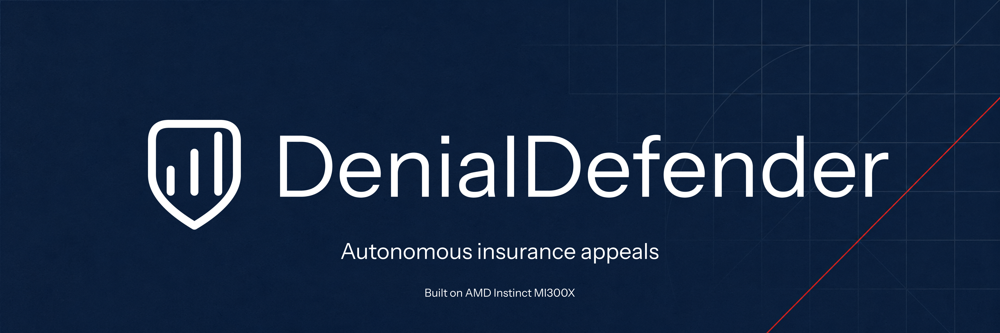
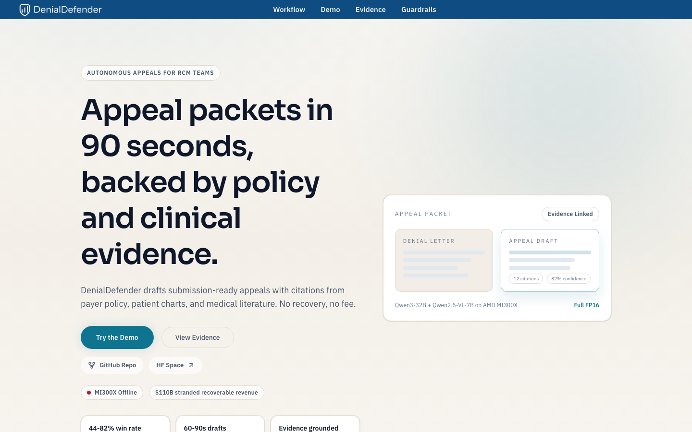

<p align="center">
  
  <br>
  <strong>Denial Defender</strong>
  <br>
  <strong>Autonomous Insurance Appeals for Hospital Revenue Cycle Teams</strong>
  <br>
  <em>Maximizing hospital recovery through AI-driven clinical advocacy.</em>
  <br><br>
  <a href="https://huggingface.co/spaces/lablab-ai-amd-developer-hackathon/denialdefender">
    
  </a>
  <br><br>
  <a href="#the-problem">The Problem</a> •
  <a href="#the-solution">The Solution</a> •
  <a href="#architecture">Architecture</a> •
  <a href="#tech-stack">Tech Stack</a> •
  <a href="#quick-start">Quick Start</a>
</p>

---

> **Built for the [AMD Developer Hackathon 2026](https://lablab.ai/ai-hackathons/amd-developer) · Team Sophon · Vision & Multimodal AI Track**

---

**Live product:** [trydenialdefender.com](https://www.trydenialdefender.com)



## My Contribution

I built the working prototype across the Next.js review interface, FastAPI orchestration, multimodal intake, retrieval pipeline, synthetic evaluation data, and AMD MI300X deployment workflow.

---

## The Problem

US hospitals leave **$262 billion+** in recoverable revenue on the table every year. Writing insurance appeal letters is a labor-intensive, specialized workflow that currently fails to scale.

| Metric | Industry Benchmark |
|---|---|
| In-network claims denied | **19%** (KFF, 2024) |
| Denials ever appealed | **< 1%** |
| Appeal success rate (when filed) | **44–82%** |
| **Stranded Recoverable Revenue** | **$262B+ Annually** |

The gap between "denied" and "appealed" represents one of the largest unautomated financial leaks in the US healthcare system.

## The Solution

**DenialDefender** is an AI-native clinical advocacy system that drafts high-fidelity insurance appeal letters at scale. By leveraging the **AMD Instinct™ MI300X**, we provide hospital billing teams with a professional-grade tool that produces a complete appeal packet in **60–90 seconds**:

- ✅ **Multimodal Intake**: Reads scanned faxes and digital PDFs with equal precision.
- ✅ **Four-Pillar RAG**: Automatically cross-references patient charts, payer policies, clinical literature, and past winning appeals.
- ✅ **Citation-Backed**: Every medical necessity argument is linked to specific clinical data or policy clauses.
- ✅ **Human-in-the-Loop**: Generates professional drafts for final clinical review and submission.

## Architecture

DenialDefender utilizes a hybrid-cloud architecture, keeping sensitive processing on high-performance AMD hardware while providing a low-friction web interface.

```text
┌────────────────────────────────────────────────────────────────┐
│                        Frontend (Next.js 15)                   │
│   Drag-drop denial upload → Streaming generation → Review UI   │
└──────────────────────────┬─────────────────────────────────────┘
                           │ REST API (Secure Tunnel)
┌──────────────────────────▼─────────────────────────────────────┐
│                     Backend (FastAPI)                          │
│                                                                │
│  ┌──────────┐  ┌──────────┐  ┌───────────┐  ┌──────────────┐  │
│  │ Denial   │  │ Patient  │  │ Policy    │  │ Past-Appeal  │  │
│  │ Intake   │  │ Context  │  │ Retrieval │  │ Retrieval    │  │
│  │ (Qwen-VL)│  │ Retrieval│  │           │  │              │  │
│  └────┬─────┘  └────┬─────┘  └─────┬─────┘  └──────┬───────┘  │
│       └──────────────┴──────────────┴───────────────┘          │
│                           │                                    │
│              ┌────────────▼────────────┐                       │
│              │   Appeal Generation     │                       │
│              │   (Qwen2.5-32B via      │                       │
│              │    vLLM + ROCm)         │                       │
│              └────────────┬────────────┘                       │
│                           │                                    │
│              ┌────────────▼────────────┐                       │
│              │  Clinical Review Ready  │                       │
│              └─────────────────────────┘                       │
└──────────────────────────┬─────────────────────────────────────┘
                           │
┌──────────────────────────▼─────────────────────────────────────┐
│              AMD Instinct™ MI300X (192 GB)                     │
│    Co-resident execution of Vision & Reasoning Models           │
└────────────────────────────────────────────────────────────────┘
```

## Tech Stack

| Layer | Technology |
|---|---|
| **Compute** | **AMD Instinct™ MI300X** (192 GB HBM3, 5.3 TB/s) |
| **Reasoning** | Qwen2.5-32B-Instruct (FP16, Unquantized) |
| **Vision** | Qwen2.5-VL-7B (FP16, Unquantized) |
| **Inference** | vLLM + ROCm™ 6.2 |
| **Backend** | FastAPI · Python 3.12 · pdfplumber |
| **Frontend** | Next.js 15 · Tailwind CSS v4 · React 19 |

## Quick Start

### Prerequisites
- Python 3.12+
- Node.js 20+
- Access to an AMD MI300X Instance (for full inference)

### 1. Installation
```bash
git clone https://github.com/jorgesandev/denialdefender.git
cd denialdefender
```

### 2. Environment Setup
```bash
cp .env.example backend/.env
cp .env.example frontend/.env.local
```

### 3. Execution
**Start the Backend:**
```bash
cd backend
pip install -r requirements.txt
uvicorn app.main:app --port 9000
```

**Start the Frontend:**
```bash
cd frontend
npm install
npm run dev
```

The application will be available at `http://localhost:3000`.

## Detailed Documentation
- [Backend & Infrastructure](docs/backend.md)
- [Frontend & Design](docs/frontend.md)
- [AI Model Strategy](docs/ai_models.md)
- [Data Pipeline](docs/data_pipeline.md)
- [Synthetic Data Strategy](docs/data_context.md)

---

## Why AMD MI300X?

DenialDefender's workload is **memory-bandwidth-bound long-context inference**. Each appeal requires ingesting massive context windows (patient charts + payer policies).

The MI300X is uniquely suited for this architecture:
- **192 GB HBM3**: Allows co-resident execution of vision and reasoning models in full precision.
- **5.3 TB/s Bandwidth**: Essential for rapidly processing 40K+ token context windows.
- **Economic Scale**: Reduces per-appeal compute cost to ~$0.03, enabling a contingency-based business model.

---

## Author

**Jorge Alejandro Sandoval Romo** · Team Sophon

[](https://jorgesandoval.dev)
[](https://linkedin.com/in/jorgesandev)

---

<p align="center">
  <strong>Team Sophon</strong> · AMD Developer Hackathon 2026 · Vision & Multimodal AI Track
</p>
